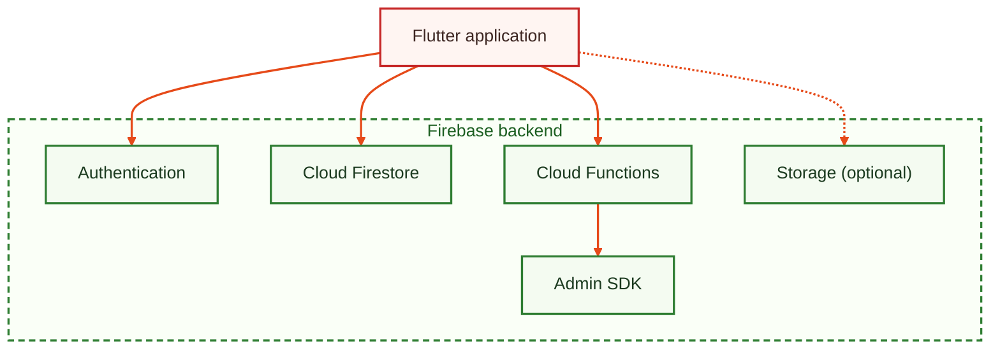
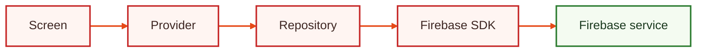
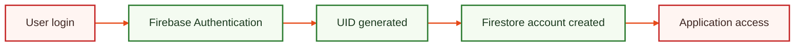
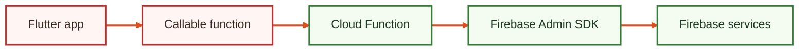
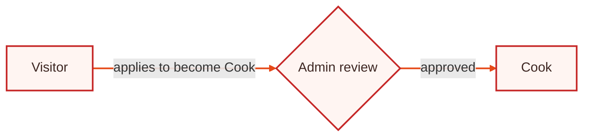
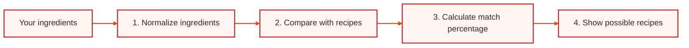
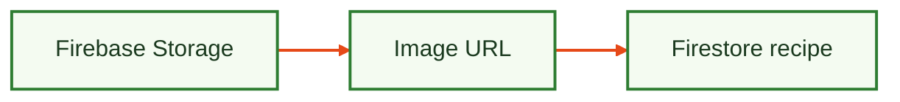
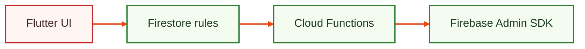

**A Flutter-based recipe and cooking assistant application powered by Firebase.**

<p>
  
  
  
  
  
  
</p>

<p>
  <a href="#features"></a>
  <a href="#tech-stack"></a>
  <a href="#architecture"></a>
  <a href="#firebase-apis"></a>
  <a href="#roles"></a>
  <a href="#make-ur-plate"></a>
  <a href="#getting-started"></a>
  <a href="#roadmap"></a>
</p>

</div>

<a id="features"></a>

## ✨ Features

<table width="100%">
  <tr>
    <td align="center" width="25%">
      <b>🍲 Recipe discovery</b><br />
      <sub>Browse recipes with images, ingredients and cooking steps</sub>
    </td>
    <td align="center" width="25%">
      <b>🔍 Search</b><br />
      <sub>Find the recipe you are looking for, fast</sub>
    </td>
    <td align="center" width="25%">
      <b>❤️ Favorites</b><br />
      <sub>Save the recipes you love</sub>
    </td>
    <td align="center" width="25%">
      <b>🥕 Pantry management</b><br />
      <sub>Keep track of the ingredients you have</sub>
    </td>
  </tr>
  <tr>
    <td align="center">
      <b>🛒 Grocery lists</b><br />
      <sub>Organize what you need to buy</sub>
    </td>
    <td align="center">
      <b>📅 Meal planning</b><br />
      <sub>Plan your meals ahead of time</sub>
    </td>
    <td align="center">
      <b>🍽️ Make Ur Plate</b><br />
      <sub>Recipe recommendations based on your ingredients</sub>
    </td>
    <td align="center">
      <b>🔐 Role management</b><br />
      <sub>Admin, Cook and Visitor roles</sub>
    </td>
  </tr>
</table>

<a id="tech-stack"></a>

## 🧰 Tech stack

| 🎨 Frontend | ☁️ Backend |
| :-- | :-- |
| Flutter | Firebase Authentication |
| Dart | Cloud Firestore |
| Provider (state management) | Cloud Functions |
| Material UI | Firebase Admin SDK |
| Shared Preferences | Firebase Storage *(optional)* |


<a id="architecture"></a>

## 🏗️ Architecture

### Application overview



### Frontend structure

The app follows a **feature-based** Flutter architecture.

```text
lib/
├── app/
├── core/
└── features/
    ├── auth/
    ├── recipes/
    ├── favorites/
    ├── pantry/
    ├── grocery/
    ├── meal_plan/
    ├── profile/
    ├── admin/
    └── cook/
```

Data moves from the screen down to Firebase in this order:



<a id="firebase-apis"></a>

## 🔥 Firebase APIs used

### Firebase Authentication

> Package: `firebase_auth`

- Register users
- Login users
- Logout
- Password reset
- User identity management



### Cloud Firestore

> Package: `cloud_firestore`

Used as the main database.

<table>
  <tr>
    <th align="left" colspan="2">Stores</th>
  </tr>
  <tr valign="top">
    <td>
      <ul>
        <li>Recipes</li>
        <li>Users</li>
        <li>Roles</li>
        <li>Favorites</li>
      </ul>
    </td>
    <td>
      <ul>
        <li>Pantry items</li>
        <li>Grocery lists</li>
        <li>Meal plans</li>
        <li>Requests</li>
      </ul>
    </td>
  </tr>
</table>

```text
Cloud Firestore
├── accounts/{uid}
├── recipes/{recipeId}
├── users/{uid}/
│   ├── favorites
│   └── pantryItems
├── cookApplications
└── recipeRequests
```

### Cloud Functions

Used for secure backend operations, for example:

- Admin user management
- Delete users
- Block users
- Change roles



### Firebase Admin SDK

> [!WARNING]
> The Admin SDK is used only in backend environments, never inside the Flutter app.

It is responsible for:

- Creating administrators
- Managing authentication users
- Updating roles
- Privileged operations

<a id="roles"></a>

## 🔐 Role management

Pocket Cook has three roles.

<table width="100%">
  <tr>
    <th align="center" width="33%">👀 Visitor</th>
    <th align="center" width="33%">🧑‍🍳 Cook</th>
    <th align="center" width="33%">👑 Admin</th>
  </tr>
  <tr valign="top">
    <td>
      <ul>
        <li>Browse recipes</li>
        <li>Search recipes</li>
        <li>Save favorites</li>
        <li>Request recipes</li>
        <li>Apply to become Cook</li>
      </ul>
    </td>
    <td>
      <ul>
        <li><b>Everything a Visitor can do</b></li>
        <li>Add recipes</li>
        <li>Edit recipes</li>
        <li>Manage own recipes</li>
      </ul>
    </td>
    <td>
      <b>Full authority</b>
      <ul>
        <li>Manage users</li>
        <li>Delete users</li>
        <li>Block users</li>
        <li>Promote users</li>
        <li>Approve Cook requests</li>
        <li>Manage all recipes</li>
      </ul>
    </td>
  </tr>
</table>

A Visitor becomes a Cook by applying, and an Admin approves the request:



## 🍲 Recipe system

Every recipe contains:

<table width="100%">
  <tr>
    <td align="center">📝 <b>Title</b></td>
    <td align="center">📖 <b>Description</b></td>
    <td align="center">🖼️ <b>Image</b></td>
  </tr>
  <tr>
    <td align="center">🥕 <b>Ingredients</b></td>
    <td align="center">👩‍🍳 <b>Cooking steps</b></td>
    <td align="center">🏷️ <b>Category</b></td>
  </tr>
  <tr>
    <td align="center">📊 <b>Difficulty</b></td>
    <td align="center">⏱️ <b>Preparation time</b></td>
    <td align="center">👤 <b>Creator information</b></td>
  </tr>
</table>

Recipes live in Firestore at `recipes/{recipeId}`. Example fields:

| Field | Holds |
| :-- | :-- |
| `title` | The recipe name |
| `ingredients` | The ingredient list |
| `steps` | The cooking steps |
| `imageUrl` | The recipe image |
| `createdByUid` | The UID of the creator |
| `cookName` | The name of the Cook who created it |

<a id="make-ur-plate"></a>

## 🍽️ Make Ur Plate

A smart recommendation feature. You enter the ingredients you have:

| Ingredient | Amount |
| :-- | --: |
| Chicken | 500 g |
| Rice | 1 kg |
| Egg | 3 pcs |

The system then works through four steps:



Example result:

> **🍚 Chicken Rice Bowl**
>
>  

## 🥕 Pantry system

Users maintain the ingredients they have available:

| Ingredient | Amount |
| :-- | --: |
| Chicken | 500 g |
| Rice | 2 kg |
| Egg | 6 pcs |

The system compares pantry data with recipes.

## 🖼️ Image system

### Current approach

Recipe images are bundled with the app in `assets/images/recipes/`, and a recipe points to its image like this:

```json
{
  "imageAsset": "assets/images/recipes/rice.png"
}
```

### Future production



## 🛡️ Security architecture

> [!IMPORTANT]
> Security is enforced by backend rules, not only by hiding UI buttons.

Every request passes through these layers:




<a id="getting-started"></a>

## ⚙️ Getting started

### Setup

```bash
# 1. Install the command line tools
npm install -g firebase-tools
dart pub global activate flutterfire_cli

# 2. Log in to Firebase
firebase login

# 3. Configure Firebase for the app
flutterfire configure

# 4. Install dependencies
flutter pub get
```

### Run the app

```bash
# Development
flutter run

# Firebase mode
flutter run --dart-define=USE_FIREBASE=true
```

### Build a release

```bash
# APK
flutter build apk --release --split-per-abi

# Google Play (app bundle)
flutter build appbundle --release
```

<a id="roadmap"></a>

## 🚀 Future improvements

- [ ] 🤖 AI recipe assistant
- [ ] 🥗 Nutrition tracking
- [ ] 📷 Barcode scanner
- [ ] 🎙️ Voice cooking mode
- [ ] 📥 Recipe import
- [ ] 👥 Social cooking community
- [ ] 🧑‍🍳 Chef profiles
- [ ] ⭐ Ratings and reviews

## 📋 Project information

| Project | Pocket Cook |
| :-- | :-- |
| Frontend | Flutter |
| Backend | Firebase |
| Database | Cloud Firestore |

<div align="center">

**Built by Md Mahruf**

<a href="https://github.com/your-username"></a>
<a href="https://www.linkedin.com/in/your-username"></a>
<a href="mailto:you@example.com"></a>

<sub>If Pocket Cook helps you cook something good, give it a star.</sub>


</div>
